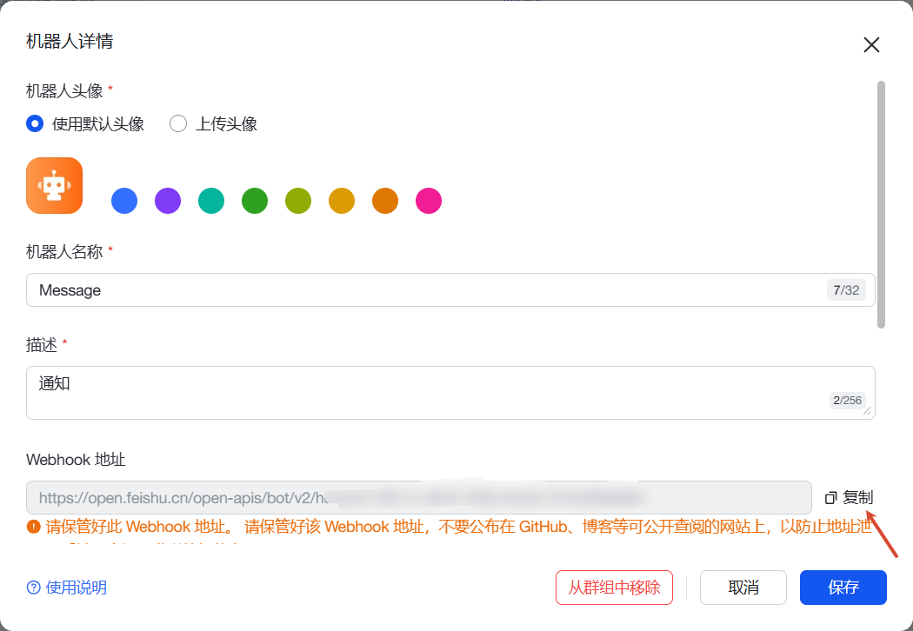
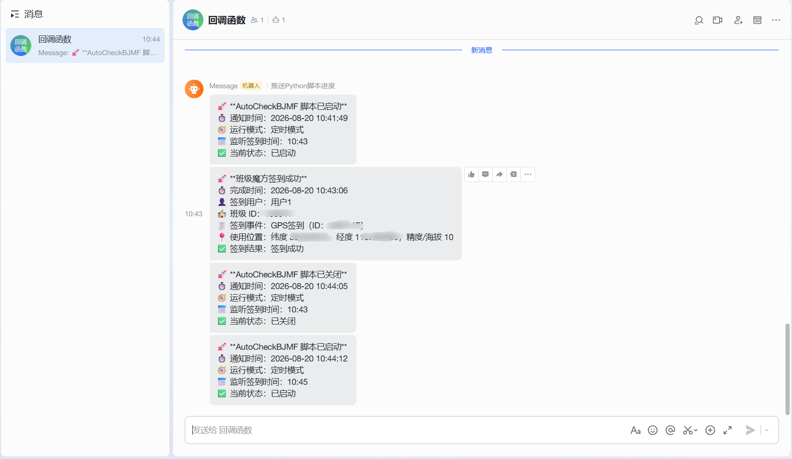

# AutoCheckBJMF

班级魔方 GPS 自动签到脚本。项目支持多账号、多班级、多定位点、定时触发、失败重试，并可通过 PushPlus 或飞书自定义机器人推送运行和签到结果通知。

> 本项目仅供学习交流使用。请遵守学校、课程和平台规则，使用本项目产生的后果由使用者自行承担。

## 功能特点

- **GPS 定位签到**：自动查找班级魔方页面中的 GPS 签到任务并提交定位信息。
- **多账号支持**：可以为多个账号依次执行签到，每个账号使用独立 Cookie。
- **多班级支持**：一个配置文件中可以保存多个班级 ID，脚本会按班级逐个处理。
- **多定位点支持**：可配置多个真实定位点，签到时遍历定位点并提交。
- **坐标微偏移**：提交前会对经纬度做小范围随机偏移，避免多个账号使用完全相同坐标。
- **定时执行**：支持每天多个 `HH:MM` 时间点自动签到。
- **立即执行**：提供 `once.py`，可临时手动执行一次签到。
- **失败重试**：签到失败后会等待 30 秒重试一次，仍失败则 5 分钟后再重试一次。
- **消息通知**：签到成功时可同时发送 PushPlus 和飞书通知；`main.py` 启动和关闭时也会通知当前监听的签到时间。

## 项目结构

| 路径 | 说明 |
|------|------|
| `make_config.py` | 配置向导，扫码登录、获取 Cookie、录入班级/坐标/定时/通知配置 |
| `main.py` | 定时运行入口，适合长期挂在电脑或服务器上 |
| `once.py` | 一次性运行入口，启动后立即执行一次签到 |
| `core/` | 核心模块，包含配置加载、签到、通知、定位、日志、倒计时等复用逻辑 |
| `config.json` | 运行配置，由 `make_config.py` 生成，已被 `.gitignore` 忽略 |

## 安装依赖

推荐使用 `uv`：

```bash
uv sync
```

也可以直接使用 `pip`：

```bash
pip install beautifulsoup4 drissionpage prompt-toolkit questionary requests rich schedule
```

项目要求 Python 3.11 或更高版本。

## 生成配置

配置过程需要打开浏览器扫码登录和选择地图坐标，建议在 Windows 桌面环境完成：

```bash
uv run python make_config.py
```

或：

```bash
python make_config.py
```

配置向导会生成 `config.json`，主要包含：

```json
{
    "classes": ["136341", "136342"],
    "locations": [
        {"lat": "22.766885", "lng": "108.451339", "acc": "10"}
    ],
    "cookies": [
        "remember_student_59ba36addc2b2f9401580f014c7f58ea4e30989d=xxxxx"
    ],
    "scheduletimes": ["08:00", "12:30"],
    "pushplus": "",
    "feishu_webhook": "",
    "debug": false
}
```

### 1. 获取班级 ID 和 Cookie

配置向导会自动打开班级魔方微信扫码登录页面。

1. 使用微信扫码登录。
2. 登录成功后，脚本会从课程列表中提取班级 ID。
3. 脚本会监听请求并捕获 Cookie。
4. 如果有多个账号，按提示继续扫码添加。
5. 如果课程列表不完整，可以手动补充班级 ID。

Cookie 有有效期，过期后需要重新运行 `make_config.py` 刷新。

### 2. 配置签到位置

配置向导会打开腾讯地图坐标拾取工具。你可以直接复制地图中的坐标并粘贴到终端。

支持的输入格式示例：

```text
22.766885,108.451339
22.766885，108.451339
lat:22.766885 lng:108.451339
```

脚本按 `纬度,经度` 解析。坐标输入后还会要求输入 `acc`，不知道填什么时可以直接使用默认值 `10`。

### 3. 配置定时签到时间

定时时间会保存到 `scheduletimes`，`main.py` 会按这些时间点每天自动执行。

支持输入：

```text
08:00
8:00
8：00
8 00
```

脚本会统一规范化成 `HH:MM`，例如 `8：00` 会保存为 `08:00`。不配置时间时，`main.py` 会启动后立即执行一次签到。

### 4. 配置消息通知

通知是可选项。PushPlus 和飞书可以同时配置；都配置时，签到成功和 `main.py` 启动/关闭通知会两个渠道都发送。

#### PushPlus

PushPlus 只需要在配置向导中填入 Token。Token 获取、通道绑定、消息限制等内容建议直接参考 [PushPlus 官方文档](https://www.pushplus.plus/doc/)。

#### 飞书 Webhook

在飞书群中添加自定义机器人，复制机器人 Webhook 地址，填入配置向导的 `feishu_webhook`。



签到成功后的飞书通知会包含用户、班级、签到事件、使用位置和签到结果。



## 运行项目

### 定时自动签到

```bash
uv run python main.py
```

或：

```bash
python main.py
```

`main.py` 会读取 `scheduletimes` 注册定时任务，并在终端显示下一次任务倒计时。按 `Ctrl+C` 可以停止脚本。

`main.py` 会在以下场景发送通知：

- 脚本启动
- 脚本关闭
- 签到成功

### 立即签到

```bash
uv run python once.py
```

或：

```bash
python once.py
```

`once.py` 启动后立即执行一次签到，不发送启动/关闭通知，只在签到成功时发送通知。

## 服务器部署建议

如果要部署到云服务器，建议先在 Windows 桌面环境运行 `make_config.py` 生成 `config.json`，再把配置文件上传到服务器。

使用 pm2 托管示例：

```js
module.exports = {
  apps: [{
    name: "AutoCheckBJMF",
    script: "main.py",
    interpreter: "python3",
    cwd: "/path/to/AutoCheckBJMF",
    restart_delay: 5000,
    max_restarts: 10,
    log_date_format: "YYYY-MM-DD HH:mm:ss"
  }]
};
```

启动：

```bash
pm2 start ecosystem.config.js
pm2 logs AutoCheckBJMF
pm2 save
```

云服务器通常没有图形界面，不适合运行 `make_config.py`。Cookie 过期后，需要回到 Windows 桌面环境重新扫码更新配置。

## 常见问题

**Q：为什么没有生成 `config.json`？**  
A：请确认配置向导最后选择了保存。当前版本默认保存，只有明确选择不保存才会跳过导出。

**Q：签到失败最常见的原因是什么？**  
A：通常是 Cookie 过期、网络异常、班级 ID 错误，或者页面结构发生变化。

**Q：PushPlus 和飞书能同时发吗？**  
A：可以。`pushplus` 和 `feishu_webhook` 都配置时，两个渠道都会发送。

**Q：`once.py` 会发送启动和关闭通知吗？**  
A：不会。`once.py` 只在签到成功时通知；启动和关闭通知只属于长期运行的 `main.py`。

## 免责声明

本项目仅供学习交流使用，请勿用于作弊或违反平台规则的行为。使用本项目产生的一切后果由使用者自行承担。
